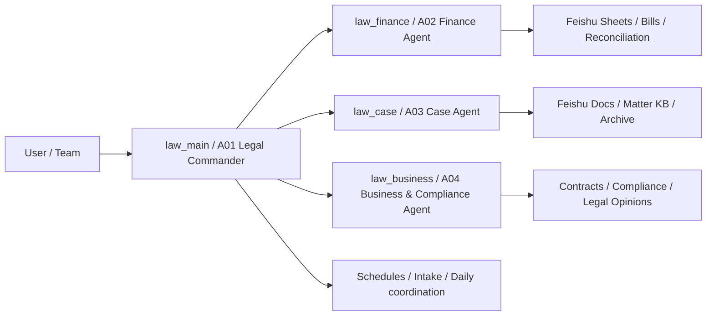

# Legal OPC Architecture v1

## Purpose

This architecture is designed for a legal practice using OpenClaw 4.10 with:

- one commander
- three legal specialist agents
- one shared constitution
- one layered memory system
- full specialist permissions
- Feishu-centered operations
- no N8N dependency

## Topology

## Legal workflow completeness requirements

The system must cover these workflows explicitly:

1. client intake
2. conflict check
3. schedule and deadline capture
4. matter opening
5. evidence and file registration
6. drafting and review
7. contract and compliance review
8. billing and reimbursement
9. archive and retrieval
